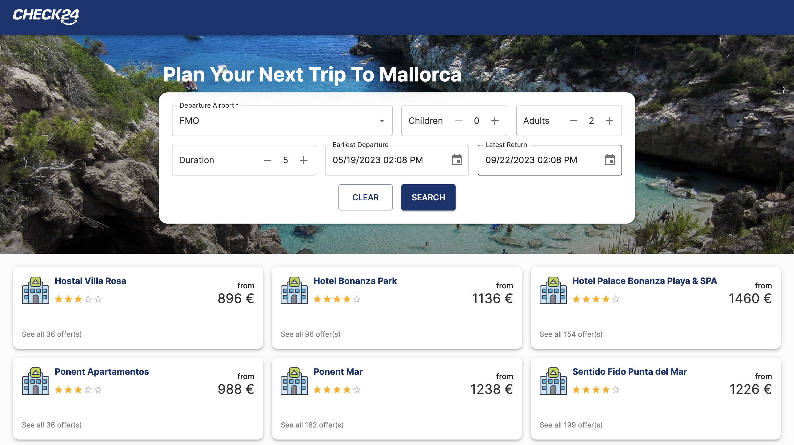
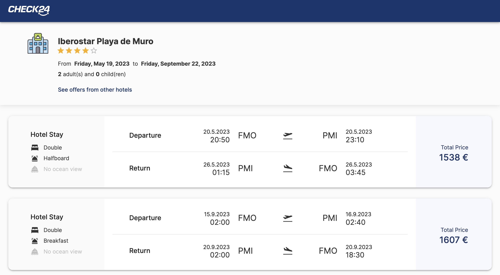
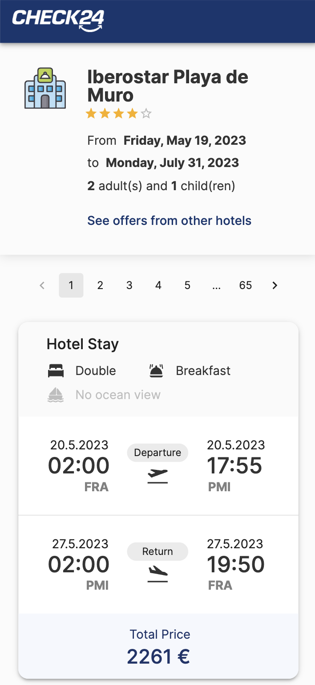

# CheckMine - Check24 Hoilday Challenge  

My solution for [Check24 Holiday Challenge](https://github.com/check24-scholarships/holiday-challenge).  

## Tech Stack  
1. Frontend: ReactJS, Material UI  
2. Backend: NodeJS, ExpressJS, Python (to populate the database from csv files)    
3. Database: PostgreSQL  
4. Container: Docker  

## Installation  
1. Clone the repository with the submodules (frontend and backend)  
    ```shell
    git clone --recurse-submodules git@github.com:jazli1999/CheckMine.git
    ```  
2. Put `hotels.csv` and `offers.csv` under `CheckMine/CheckMine-Backend/scripts`, which later will be used to populate the database  

3. Run with docker
    ```shell
    cd CheckMine
    docker-compose -f docker-compose.yml up  
    ```  
**NOTE**: First time runing docker-compose could take **very long** (~1h15min on my MacBook Air), to populate the database. `offers.csv` is loaded into database by chunks, and progress is indicated with `tqdm`. However `tqdm` dose not work very well with docker-compose as stated in [this issue](https://github.com/tqdm/tqdm/issues/771), so I used a workaround to directly print the `tqdm` object. It does not look very good, but it works and displays the importing progress.  

## Demo  
- A deploy can be found [here](https://urchin-app-h2t7y.ondigitalocean.app/). On some requests (e.g. with airport FRA), the performance may not look ideal (~5s), because I chose the cheapest plan on DigitalOcean. But for most cases, loading time should be ~1s. 

  When running locally (or with proper CPU/network hardware support), the solution should have a satisfactory performance for all scenarios (see <a href="#performance">Performance</a>). 
- Also a screen recording [here](https://youtu.be/yOYuuxw0_rM) in case neither the deploy nor the installation works.  

## Performance  
When running on my laptop, requests take ~200ms on average (by observation). When running in docker, it is slightly slower, ~400ms. 

### Database Optimization  
Table partition is adopted for performance optimization in this solution. 
When populating the database, a new column `duration` is added, which is calculated by `inboundarrivaldatetime - outbounddeparturedatetime`.  
The `offer` table is first partitioned by departure airport, and those large partitions (e.g. offers for `FRA`) with still millions of offers are partitioned again by durations.  

### Client Optimization  
Data are fetched with server-side pagination, avoiding large network traffic.  

## Addon Features  

### Responsive Design  
View optimized for almost any screen size (PC, tablet, mobile).  
  
  

### User Experience Details
1. A "Clear" button is provided to clear the form.  
2. A "See offers from other hotels" link is provided on the hotel offer page, for users to easily navigate back.  
3. Request overview is displayed in hotel offer page, so the user don't have to go back-and-forth to confirm they have input the correct information.  